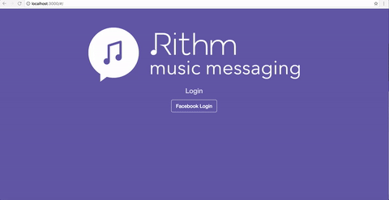

# Facebook login
Using facebook API and AngularJS technology, I log into my music app

## APIs and technologies
- HTML5, CSS, JS, [Bootstrap](http://getbootstrap.com/)
- [AngularJS](https://angularjs.org/)
- [NodeJS](https://nodejs.org/en/)
- [Express](http://expressjs.com/)
- [Grunt](http://gruntjs.com/) for automation
- [JSDOC](http://usejsdoc.org/) for documentation.

## License

The contents of this repository are covered under the [MIT License](LICENSE.txt).
